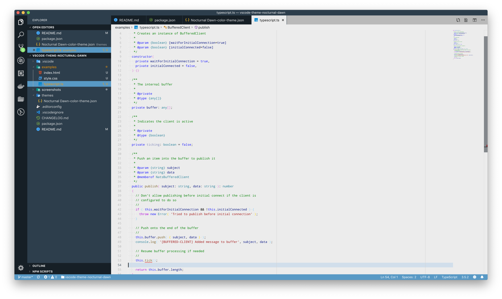

# VSCode theme: Nocturnal Dawn

This theme is a light theme but with some dark influences.
It uses a not fully bright white editing area to focus on.
The sidebar and other UI elements are kept dark for contrast.

I originally started this theme by merging the UI style from the [Slack Theme Ochin](https://marketplace.visualstudio.com/items?itemName=felipe-mendes.slack-theme) and the syntax from [Light+ dimmed](https://marketplace.visualstudio.com/items?itemName=iredchuk.light-plus-dimmed).

Screenshots were made with

* [Material icon theme](https://marketplace.visualstudio.com/items?itemName=PKief.material-icon-theme)
* [Bracket pair colorizer](https://marketplace.visualstudio.com/items?itemName=CoenraadS.bracket-pair-colorizer)
